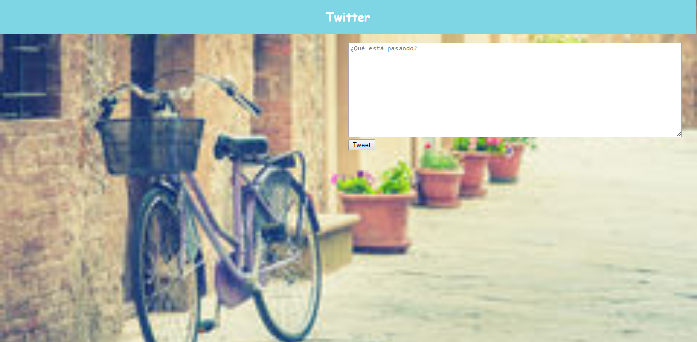

### Proyecto: "Newsfeed de Twitter" ###

--------------------------------------------------------------

1) __Objetivo :__

  Para este proyecto nos indican que debemos replicar el newsfeed de Twitter de forma que nos quede de la siguiente manera:
  <https://media.giphy.com/media/3ov9jP4RIGQCUQOScg/giphy.gif>

2) __Desarrrollo__

   ***Parte introductoria***

  Para empezar creo mi estructura html, coloco el título con un ícono representativo de twitter luego ingreso el título le pongo color y color para el header con css y luego agrego la imagen que ocupará toda la ventana del navegador y eso lo logro gracias a css con lo que me queda de la siguiente forma:

  

  2.1 ***Versión 0.0.1***

  Para esta parte piden realizar:

  2.1.1 Diseñar un formulario que permita ingresar un texto y un botón para "twittear".

  2.1.2 Agregar un evento de click al botón o de submit al formulario.

  2.1.3 En el evento, obtener el texto.

  2.1.4 Agregar el texto al HTML.

 Comenzamos:

 2.1.1 Nos piden diseñar un formulario donde podamos ingresar un texto y un botón para twittear,me queda así:

 

 2.1.2 para esta parte tenemos que agregar un evento de click por lo que agrego onclick al html y js ingreso una función.
